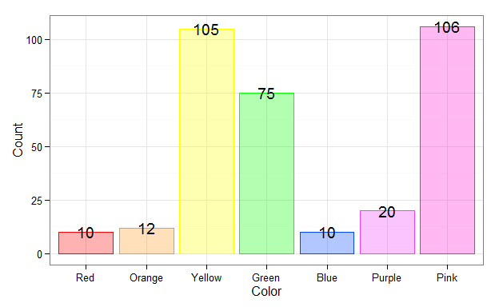

Maya's First Computer Graph
=================================================
This report covers Maya's first graph on the computer (Maya Beasley, PI).  She loves doing graphs on the computer, especially picking the colors.

<!--  Set the working directory to the repository's base directory; this assumes the report is nested inside of two directories.-->


<!-- Set the report-wide options, and point to the external code file. -->

```
## Working directory:  D:/Users/Will/Documents/GitHub/MayaCandyGraphs
```
<!-- Load the packages.  Suppress the output when loading packages. --> 


<!-- Load any Global functions and variables declared in the R file.  Suppress the output. --> 


<!-- Declare any global functions specific to a Rmd output.  Suppress the output. --> 


<!-- Load the datasets.   -->


<!-- Tweak the datasets.   -->


## Notes

**Note 1**: The current report covers 7 possible values for `Color`.

# Marginals
 

|Color  | Count|
|:------|-----:|
|Red    |    10|
|Orange |    12|
|Yellow |   105|
|Green  |    75|
|Blue   |    10|
|Purple |    20|
|Pink   |   106|


# Questions
## Unanswered Questions
 1. How long is the graph when all of the colors are at the number '9,999'?

## Answered Questions
 1. Does the color get dark on the color wheel when it goes out, or lighter?  The answer is 'it gets darker when it goes out'.

# Session Information
For the sake of documentation and reproducibility, the current report was build on a system using the following software.


```
Report rendered by Will at 2014-10-05, 12:59 -0500
```

```
R version 3.1.1 Patched (2014-09-27 r66695)
Platform: x86_64-w64-mingw32/x64 (64-bit)

locale:
[1] LC_COLLATE=English_United States.1252  LC_CTYPE=English_United States.1252    LC_MONETARY=English_United States.1252
[4] LC_NUMERIC=C                           LC_TIME=English_United States.1252    

attached base packages:
[1] stats     graphics  grDevices utils     datasets  methods   base     

other attached packages:
[1] ggplot2_1.0.0      RColorBrewer_1.0-5 scales_0.2.4       plyr_1.8.1         knitr_1.6         

loaded via a namespace (and not attached):
 [1] colorspace_1.2-4 digest_0.6.4     evaluate_0.5.5   formatR_1.0      grid_3.1.1       gtable_0.1.2    
 [7] htmltools_0.2.6  labeling_0.3     MASS_7.3-34      munsell_0.4.2    proto_0.3-10     Rcpp_0.11.3     
[13] reshape2_1.4     rmarkdown_0.3.3  stringr_0.6.2    tools_3.1.1      yaml_2.1.13     
```
